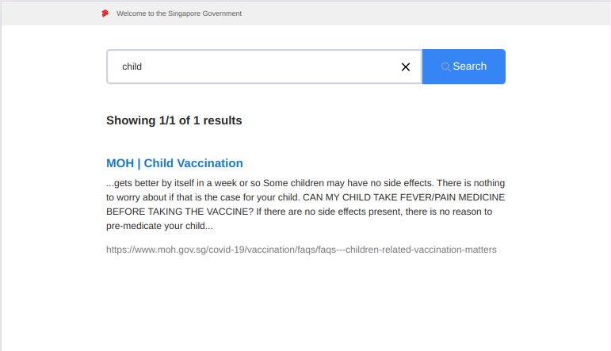
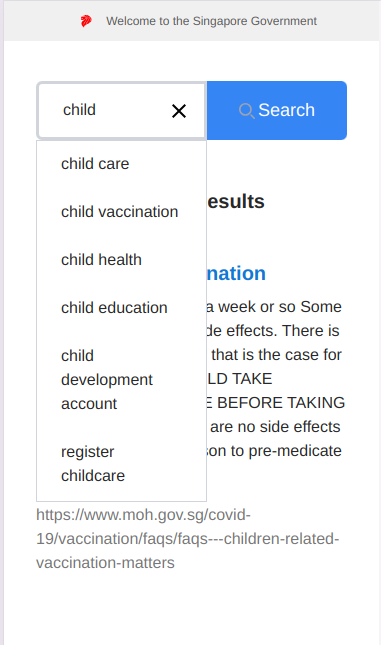
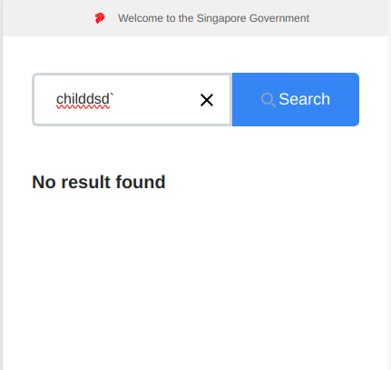
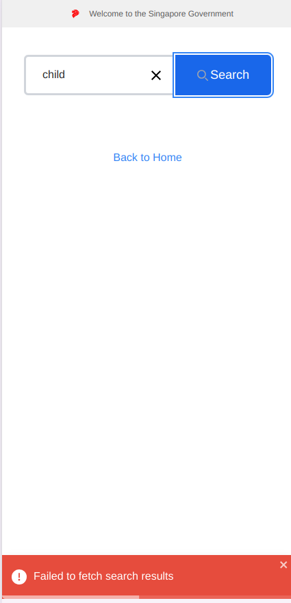

# Singgov FE Assignment - 2025

This project is a FE-only assignment, that allows user to search information on child development.

## Getting Started

- 🔗 [Prerequisites](#prerequisites)
- ⚙️ [Installation](#installation)
- 🚄 [Running the Application](#running-the-application)
- 🧪 [Building for Production](#building-for-production)
- 🧱 [Testing](#testing)
- 📷 [Docker Deployment](#docker-deployment)
- 📝 [Gitlab CI deployment](#gitlab-ci-deployment)

### Prerequisites

- Node.js (version 22 or later)
- npm (comes with Node.js)
- Docker (optional)

### Installation

1. Clone the repository:
   ```bash
   git clone https://github.com/alitonia/singgov-assessment
   cd singgov-assessment
   ```

2. Install dependencies:
   ```bash
   npm install
   ```

### Running the Application

To start the development server:

```bash
npm run dev
```

The application will be available at `http://localhost:3000` (or another port if 3000 is in use).

### Building for Production

To create a production build:

```bash
npm run build
```

The build output will be in the `build` directory.

## Testing

This project uses Jest for unit testing and Cypress for end-to-end testing.

For unit testing

```bash
npm run test:ut
```

For e2e testing

```bash
npm run cypress:open
```

## Docker Deployment

This project includes a Dockerfile for containerization.

To build and run the Docker container:

```bash
docker build -t frontend-test .
docker run -p 3000:3000 frontend-test
```

## Gitlab CI deployment

This deployment will push you code to an EC2 instance.

Make sure that you have Gitlab CI and Terraform installed, and properly configured.

Set up the following variables in your GitLab runner project (Settings > CI/CD > Variables):

* SSH_PRIVATE_KEY: Your EC2 instance's SSH private key
* EC2_HOST: Your EC2 instance's public DNS or IP address
* EC2_USER: The username for SSH access (e.g., ec2-user)

The pipeline will automatically run when you push changes to the main branch. To manually trigger:

* Go to your project on GitLab.
* Navigate to CI/CD > Pipelines.
* Click "Run Pipeline" and select the main branch.

## Deployment sample

A sample of this application is deployed to http://13.239.169.213:80 using an EC2 instance.

## Preview

## Preview

* Desktop view

  

* Mobile view

  

* Empty search view

  

* Network error

  
